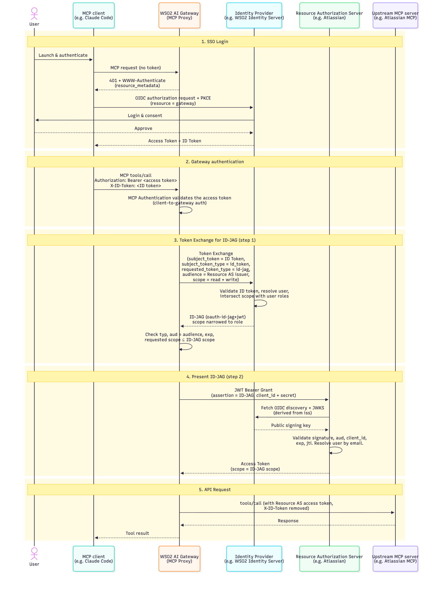
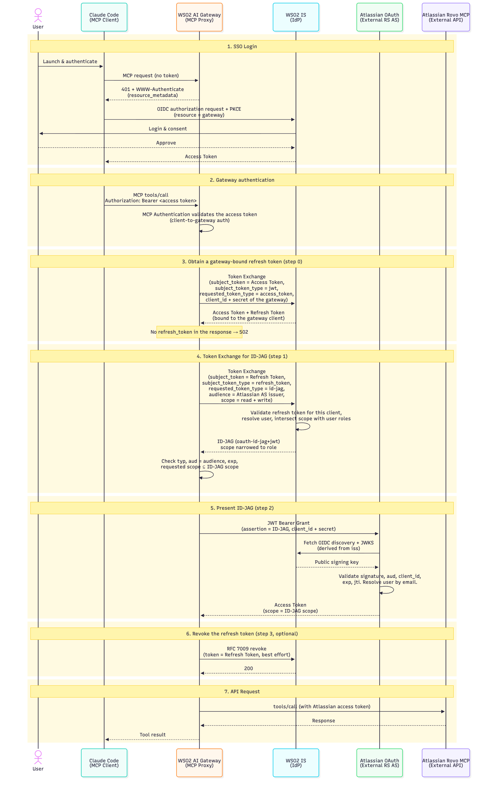

# mcp-auth-id-jag

A custom policy for the [WSO2 API Platform](https://wso2.com/api-platform/) AI
Gateway. It runs **after MCP Authentication** has validated
the client's gateway token. It obtains a **per-user access token for the
upstream MCP server** through the Identity Assertion JWT Authorization Grant
profile, [draft-ietf-oauth-identity-assertion-authz-grant](https://datatracker.ietf.org/doc/draft-ietf-oauth-identity-assertion-authz-grant/),
and injects that token before the request is forwarded. It has no
client-facing behaviour: MCP Authentication is the client-to-gateway half,
this policy is the gateway-to-upstream half.

Any Identity Provider (IdP) that issues ID-JAGs and any Resource Authorization
Server (Resource AS) that accepts them work. The diagrams below use this PoC's
instances, WSO2 Identity Server and Atlassian, as examples.

Written in Go against `github.com/wso2/api-platform/sdk/core` v0.3.5 and
compiled into the gateway image with the `ap` CLI. Policy version `v0.2.0`.
This is the code that is deployed and exercised on the PoC gateway; the unit
suite in `id_jag_test.go` covers both assertion flows end to end against fake
IdP and Resource AS servers.

---

## 1. Assertion types: what the spec allows, what this policy supports

The profile calls the credential the gateway presents to the IdP the
**identity assertion**. It is the `subject_token` of an RFC 8693 token
exchange whose `requested_token_type` is
`urn:ietf:params:oauth:token-type:id-jag`. Section 4.3 of the draft allows
three subject token types:

| Assertion | `subject_token_type` | Spec status | This policy |
|---|---|---|---|
| OpenID Connect ID token | `urn:ietf:params:oauth:token-type:id_token` | Implementations MUST accept | **Supported**: `assertionType: id_token` |
| Refresh token | `urn:ietf:params:oauth:token-type:refresh_token` | Optional, "to obtain a new ID-JAG without a new sign-in"; must be bound to the client requesting the ID-JAG | **Supported**: `assertionType: refresh_token` |
| SAML 2.0 assertion | `urn:ietf:params:oauth:token-type:saml2` | Implementations MUST accept | Not supported, out of scope for this policy |

An **access token is not an identity assertion** and the spec does not allow it
as the subject. That is the correction over the earlier `gateway-id-jag`
policy, which sent the inbound access token.

Whichever assertion is used, the rest is the same: the IdP returns an ID-JAG,
the gateway presents it to the Resource AS in an RFC 7523 JWT-bearer grant, and
the resulting access token goes upstream.

---

## 2. Flow and configuration per assertion type

### 2.1 ID token as the assertion (`assertionType: id_token`)

The client sends the gateway access token on `Authorization` and the user's ID
token on `idTokenHeader`. Step 1 presents the ID token to the IdP, step 2
presents the ID-JAG to the Resource AS, then the policy injects the result.
There is no step 0 and no revocation.



*Source: [`docs/id-jag-flow-id-token.mmd`](docs/id-jag-flow-id-token.mmd)*

**Configuration for the ID token flow**

- `assertionType: id_token`
- `idTokenHeader` (default `X-ID-Token`): the inbound header carrying the ID
  token. A `Bearer ` prefix is tolerated. The value must be a JWT.
- Everything in [Common configuration](#23-common-configuration).

**Prerequisites**

- The client, or the agent in front of it, must actually send the ID token on
  that header. The sign-in at the IdP therefore has to request the `openid`
  scope so an ID token is issued.
- The IdP must accept `id_token` as a subject token type for ID-JAG issuance.

### 2.2 Refresh token as the assertion (`assertionType: refresh_token`)

The client sends only the gateway access token. Step 0 exchanges it at the
IdP, as the gateway's own client, for an access token plus refresh token. Step
1 presents that refresh token as the assertion, step 2 presents the ID-JAG to
the Resource AS, optional step 3 revokes the refresh token, then the policy
injects the result. A step 0 response without a refresh token is a 502: the
policy never falls back to a non-compliant assertion.

The refresh token is bound to the gateway's IdP client, which is what the
profile requires of a refresh token used as an assertion: the IdP validates it
"as it would a standard refresh_token grant", bound to the authenticated
client, unexpired, not revoked.



*Source: [`docs/id-jag-flow-refresh-token.mmd`](docs/id-jag-flow-refresh-token.mmd)*

**Configuration for the refresh token flow**

- `assertionType: refresh_token`
- `accessTokenHeader` (default `Authorization`): the inbound header carrying
  the validated gateway access token.
- `exchangeSubjectTokenType` (default `jwt`): the `subject_token_type` the IdP
  expects for that access token in step 0, `jwt` or `access_token`.
- `exchangeScopes` (optional): `scope` sent in step 0.
- `idpRevocationEndpoint` (optional): the IdP's RFC 7009 endpoint. Setting it
  enables step 3. Leave it empty if the IdP has none; the refresh token then
  simply expires.
- Everything in [Common configuration](#23-common-configuration).

**Prerequisites**

- The IdP's token exchange with `requested_token_type` of `access_token` must
  return a `refresh_token` to the gateway's client. If the IdP never issues
  refresh tokens to that client, this flow cannot work and every request is a
  502 with the reason in the gateway log.
- The IdP must accept `refresh_token` as a subject token type for ID-JAG
  issuance.

### 2.3 Common configuration

Used by both flows.

| Parameter | Purpose |
|---|---|
| `credentialRef` | Name of the credential set in `config.toml` holding the IdP and Resource AS client credentials. See [section 4](#4-client-credentials-credentialref). |
| `idpTokenEndpoint` | IdP token endpoint, used for step 1 (and step 0). |
| `audience` | Issuer identifier of the Resource AS. Sent as `audience` in step 1 and checked against the ID-JAG's `aud`. |
| `resourceAsTokenEndpoint` | Resource AS token endpoint for step 2. |
| `idpScopes`, `idpResource` | Optional `scope` and RFC 8707 `resource` for step 1. The IdP may grant a subset of the scopes. |
| `resourceAsScopes` | Optional `scope` for step 2. Must be a subset of the ID-JAG's scope; the policy rejects anything outside it before calling the Resource AS. |
| `idpClientAuthMethod`, `resourceAsClientAuthMethod` | `client_secret_post` (default) or `client_secret_basic`, per endpoint. |
| `cacheResourceAccessToken` and friends | See [section 5](#5-what-is-cached). Off by default. |
| `headerName`, `valuePrefix` | Where and how the Resource AS access token is injected. Defaults `Authorization` and `Bearer`. |
| `tokenRequestTimeout`, `tokenRequestMaxRetries`, `defaultTokenTTL`, `proxyURL`, `tlsCaCert`, `tlsInsecureSkipVerify` | HTTP behaviour for every token-endpoint call. |

---

## 3. Choosing between the two assertion types

- **ID token** when the client can carry it. It is the assertion the spec
  requires every IdP to accept, it costs one IdP call per exchange, and no
  refresh token is ever minted. It needs the client or agent to forward the
  user's ID token, which not every MCP client does.
- **Refresh token** when only the gateway access token reaches the gateway, as
  with Claude Code and most off-the-shelf MCP clients. It costs one extra IdP
  call per exchange and depends on the IdP issuing refresh tokens to the
  gateway's client through token exchange.

Both can coexist on one gateway: the choice is per policy instance, so one MCP
API can use `id_token` and another `refresh_token`.

---

## 4. Client credentials: `credentialRef`

Secrets never go through the UI. The policy declares a `credentials` **system
parameter** that resolves from the gateway's `config.toml`, which in turn reads
every value from the environment. A policy instance picks a set by name with
`credentialRef`.

One set pairs the gateway's confidential client at the IdP with its
confidential client at **one** Resource AS. A gateway fronting several MCP
servers therefore has several sets, and each MCP API's policy instance points
at its own.

### Example: Atlassian and Figma behind one gateway

Two MCP servers are proxied by the same gateway, each with its own Resource AS
and its own client registration for the gateway. The IdP is the same for both,
but the IdP client may differ too, since the ID-JAG's `client_id` claim must
match the client that then authenticates at the Resource AS.

`config.toml`:

```toml
[[policy_configurations.mcp_auth_id_jag_v0.credentials]]
name                   = "atlassian"
idpClientId            = '{{ env "APIP_GW_IDJAG_ATLASSIAN_IDP_CLIENT_ID" "" }}'
idpClientSecret        = '{{ env "APIP_GW_IDJAG_ATLASSIAN_IDP_CLIENT_SECRET" "" }}'
resourceAsClientId     = '{{ env "APIP_GW_IDJAG_ATLASSIAN_RAS_CLIENT_ID" "" }}'
resourceAsClientSecret = '{{ env "APIP_GW_IDJAG_ATLASSIAN_RAS_CLIENT_SECRET" "" }}'

[[policy_configurations.mcp_auth_id_jag_v0.credentials]]
name                   = "figma"
idpClientId            = '{{ env "APIP_GW_IDJAG_FIGMA_IDP_CLIENT_ID" "" }}'
idpClientSecret        = '{{ env "APIP_GW_IDJAG_FIGMA_IDP_CLIENT_SECRET" "" }}'
resourceAsClientId     = '{{ env "APIP_GW_IDJAG_FIGMA_RAS_CLIENT_ID" "" }}'
resourceAsClientSecret = '{{ env "APIP_GW_IDJAG_FIGMA_RAS_CLIENT_SECRET" "" }}'
```

`api-platform.env` (gitignored, mode 0600, loaded by the gateway containers):

```sh
APIP_GW_IDJAG_ATLASSIAN_IDP_CLIENT_ID=...
APIP_GW_IDJAG_ATLASSIAN_IDP_CLIENT_SECRET=...
APIP_GW_IDJAG_ATLASSIAN_RAS_CLIENT_ID=...
APIP_GW_IDJAG_ATLASSIAN_RAS_CLIENT_SECRET=...
APIP_GW_IDJAG_FIGMA_IDP_CLIENT_ID=...
APIP_GW_IDJAG_FIGMA_IDP_CLIENT_SECRET=...
APIP_GW_IDJAG_FIGMA_RAS_CLIENT_ID=...
APIP_GW_IDJAG_FIGMA_RAS_CLIENT_SECRET=...
```

Policy instance on the **Atlassian MCP** API:

```yaml
- name: mcp-auth-id-jag
  version: v0
  params:
    assertionType: refresh_token
    credentialRef: atlassian
    idpTokenEndpoint: https://idp.example/oauth2/token
    idpRevocationEndpoint: https://idp.example/oauth2/revoke
    audience: https://auth.atlassian.com
    idpScopes: "read:jira-work write:jira-work"
    resourceAsTokenEndpoint: https://auth.atlassian.com/oauth/token
```

Policy instance on the **Figma MCP** API:

```yaml
- name: mcp-auth-id-jag
  version: v0
  params:
    assertionType: refresh_token
    credentialRef: figma
    idpTokenEndpoint: https://idp.example/oauth2/token
    idpRevocationEndpoint: https://idp.example/oauth2/revoke
    audience: https://www.figma.com
    idpScopes: "files:read"
    resourceAsTokenEndpoint: https://api.figma.com/v1/oauth/token
```

Same policy, same IdP, same gateway image. What differs per MCP server is the
`credentialRef`, the `audience`, the Resource AS endpoint and the scopes. The
endpoint URLs above are illustrative; use the values each Resource AS
documents.

Rules the policy enforces at load time, when the API is deployed rather than
on the first user request:

- `credentialRef` must name an existing set, or the error lists the sets that
  do exist.
- Every field of the chosen set must be non-empty, or the error names the
  field. An unset environment variable surfaces here.
- Set names must be unique.

A note on client identity: the profile says the Resource AS must reject an
ID-JAG whose `client_id` claim is not the client authenticating the JWT-bearer
request. In the common case the gateway is one client registered at both the
IdP and the Resource AS under the same id, so `idpClientId` and
`resourceAsClientId` are the same value. The policy warns at load time when
they differ but does not refuse, since some Resource ASes assign their own ids.

---

## 5. What is cached

Tokens are obtained **just in time, per request**:

- The **ID-JAG** is never cached. It is presented once to the Resource AS and
  dropped.
- The **refresh token** (refresh token flow) is never cached or stored. It
  lives only between steps 0 and 3.
- The **Resource AS access token** is cached only when
  `cacheResourceAccessToken` is `true`, which it is not by default. The cache
  is in memory, keyed by a SHA-256 of the inbound credential (ID token or
  gateway token), bounded to `cacheMaxEntries`, and an entry expires at the
  earlier of the token's own `expires_in` and the inbound credential's `exp`.
  `expiryBuffer` re-exchanges a little before expiry. When the upstream answers
  with a status in `tokenPurgeStatusCodes` (default `[401]`), only that user's
  entry is purged.

With caching off every request runs the full exchange. Concurrent requests
carrying the same credential are single-flighted either way, so an MCP
client's `initialize` plus `tools/list` burst makes one exchange, not several.

---

## 6. Error mapping

| Cause | Response |
|---|---|
| Missing or malformed inbound token | 401, `WWW-Authenticate: Bearer error="invalid_token"` |
| Step 0 or 1 `invalid_grant` / `interaction_required` | 401 as above: the IdP no longer accepts the user's credential, so the MCP client signs in again |
| Step 0 without a refresh token, `invalid_client`, ID-JAG fails validation, scope outside the ID-JAG, any step 2 rejection, transport failure | 502, with the step and reason in the gateway log, never the token values |

This policy never carries a `resource_metadata` pointer: client discovery is
MCP Authentication's job and has already happened by the time this runs. An
MCP Authentication failure never reaches this policy at all; that policy ends
the chain with its own 401.

Before step 2 the policy checks the ID-JAG against the profile: `typ` must be
`oauth-id-jag+jwt`, `aud` must be exactly the configured `audience`, `exp` must
be in the future, and the step 1 response's `issued_token_type` must be
`id-jag` when present. Required claims that are merely absent are logged, since
the Resource AS is the authority on them.

---

## 7. Full parameter reference

Required: `assertionType`, `credentialRef`, `idpTokenEndpoint`, `audience`,
`resourceAsTokenEndpoint`.

| Parameter | Default | Notes |
|-----------|---------|-------|
| `assertionType` | – | `id_token` or `refresh_token` |
| `idTokenHeader` | `X-ID-Token` | `id_token` flow: inbound header carrying the user's ID token (Bearer prefix tolerated) |
| `accessTokenHeader` | `Authorization` | `refresh_token` flow: inbound header carrying the validated gateway access token |
| `credentialRef` | – | Name of the credential set in `config.toml` |
| `idpTokenEndpoint` | – | Used for steps 0 and 1 |
| `idpClientAuthMethod` | `client_secret_post` | or `client_secret_basic` |
| `audience` | – | Resource AS issuer identifier; sent as `audience`, checked against the ID-JAG `aud` |
| `idpScopes` | `""` | `scope` for step 1; the IdP may grant a subset |
| `idpResource` | `""` | RFC 8707 `resource` for step 1 |
| `exchangeSubjectTokenType` | `jwt` | `refresh_token` flow: `subject_token_type` for the inbound access token in step 0 (`jwt` or `access_token`) |
| `exchangeScopes` | `""` | `refresh_token` flow: `scope` for step 0 |
| `idpRevocationEndpoint` | `""` | `refresh_token` flow: enables step 3 |
| `resourceAsTokenEndpoint` | – | Step 2 |
| `resourceAsClientAuthMethod` | `client_secret_post` | or `client_secret_basic` |
| `resourceAsScopes` | `""` | `scope` for step 2; must be within the ID-JAG's scope |
| `cacheResourceAccessToken` | `false` | Keep the step 2 token per user until expiry |
| `cacheMaxEntries`, `expiryBuffer`, `tokenPurgeStatusCodes` | `10000`, `2m`, `[401]` | Cache tuning, only used when caching is on |
| `headerName`, `valuePrefix` | `Authorization`, `Bearer` | Where and how the step 2 token is injected |
| `tokenRequestTimeout`, `tokenRequestMaxRetries`, `defaultTokenTTL` | `10s`, `2`, `1h` | Per-step HTTP behaviour |
| `idpTokenRequestParams` / `Headers`, `resourceAsTokenRequestParams` / `Headers` | – | Extra form fields / headers; core fields cannot be overridden |
| `proxyURL`, `tlsCaCert`, `tlsInsecureSkipVerify` | – | Transport for all token-endpoint calls |

The `credentials` system parameter is not listed: it is gateway configuration,
not a per-API parameter. See section 4.

---

## 8. Prerequisites

- A WSO2 API Platform gateway distribution (1.2.x line) and the `ap` CLI,
  since policies are compiled into the gateway image.
- The shipped **MCP Authentication** policy (`mcp-auth`) attached ahead of
  this one. It validates the client's gateway token and sets the auth context
  this policy requires.
- An **IdP** that implements RFC 8693 with
  `requested_token_type=urn:ietf:params:oauth:token-type:id-jag` and accepts
  the chosen assertion type as `subject_token_type`. For the refresh token
  flow it must also issue a refresh token to the gateway's client from a token
  exchange with `requested_token_type=access_token`.
- A **Resource AS** that accepts the IdP's ID-JAG via the JWT-bearer grant and
  has the gateway registered as a confidential client.
- A confidential client registration for the gateway at **both** the IdP and
  the Resource AS, declared as a credential set in the gateway's `config.toml`
  (section 4).

## 9. Building it into a gateway image

1. Copy this repository into the gateway distribution as
   `./policies/mcp-auth-id-jag` (a git submodule works well).
2. Add a `filePath` entry to `build.yaml`, see
   [`examples/build.yaml`](examples/build.yaml). `filePath` is relative to
   `build.yaml`, not to the current directory.
3. Add the credential sets to `configs/config.toml` and their values to
   `api-platform.env`, see [`examples/config.toml`](examples/config.toml).
4. Build from the directory containing `build.yaml`:

   ```bash
   ap gateway image build --name my-gateway
   ```

5. Point **both** `image:` lines (controller and runtime) at the new tag and
   run `docker compose up -d`. `restart` is not enough; it reuses the old
   container.

Things that bite:

- The build reports a **local policy count**. If it says `0`, a `filePath` is
  wrong, and the build still succeeds, producing an image with nothing added.
- The **builder image** decides what the policy engine contains, not
  `gateway.version` and not the base images. Use a builder from the same patch
  line as your runtime/controller bases.
- A deployment that references this policy on a gateway whose image does not
  contain it fails with
  `policy 'mcp-auth-id-jag' major version 'v0' not found in loaded policy definitions`.
- The control plane keeps the parameter schema it first saw for a given policy
  name and version. After changing `policy-definition.yaml`, bump `version`
  and re-attach the policy, or the UI keeps offering the old parameters.

## 10. Attaching to an MCP API

See [`examples/policy-attachment.yaml`](examples/policy-attachment.yaml) for a
full placeholder example.

Place it **after** MCP Authentication. There is no switch to run it without
MCP Authentication in front; a request that reaches this policy
unauthenticated is rejected.

MCP Authentication validates `POST /mcp` only in the **request body phase**,
because it needs the JSON-RPC method to apply its exemptions. Header phases of
every policy run before any body phase, so when this policy's header phase
sees no auth context it does not reject: it defers, buffers the request body,
and runs the exchange from its own body phase right after that validation.
Transport requests (`GET`/`DELETE /mcp`) carry no body, are validated by MCP
Authentication in the header phase, and are exchanged there.

Then configure the instance as in [section 2](#2-flow-and-configuration-per-assertion-type)
and [section 4](#4-client-credentials-credentialref).

## 11. Operational notes

- **Pick one client authentication method per endpoint.** WSO2 Identity
  Server, correctly per RFC 6749 §2.3, rejects requests carrying
  `client_id`/`client_secret` in the body **and** an `Authorization: Basic`
  header. Use `client_secret_basic` there. Basic credentials are
  form-urlencoded before encoding, per RFC 6749 Appendix B.
- **401 vs 502 is deliberate.** Only failures the *user* can fix by signing in
  again become 401. Everything else is 502 so MCP clients do not loop on
  sign-in when the gateway is misconfigured.
- **Logs never contain tokens or secrets.** Cache keys are SHA-256 digests and
  only the first 8 hex characters are logged. Endpoint URLs are reduced to
  scheme+host+path, and any `user:pass@` in error strings is redacted. A
  credential-set error names the empty field, never a value.
- **The cache, when on, is per gateway replica and in memory.** A restart
  simply re-exchanges. Rotated inbound tokens get a fresh exchange by design,
  since consent or authorization state may have changed.
- **Transports are shared process-wide** per proxy/TLS configuration, so many
  policy instances with the same settings reuse one connection pool.

## 12. Repository layout

```
.
├── policy-definition.yaml   # name, version, parameter schema, credentials system parameter
├── id_jag.go                # entry point, phase handling, steps 0-3, ID-JAG validation, error mapping
├── credentials.go           # credentialRef -> credential set resolution
├── cache.go                 # optional Resource AS access-token cache + single-flight group
├── token_request.go         # token-endpoint HTTP, revocation, retry, transport registry, param helpers
├── id_jag_test.go           # unit suite against fake IdP / Resource AS servers
├── go.mod / go.sum
├── examples/
│   ├── build.yaml           # how to add the policy to a gateway build
│   ├── config.toml          # credential sets, read from the environment
│   └── policy-attachment.yaml
├── docs/                    # flow diagrams (PNG) and their Mermaid sources
├── CHANGELOG.md
└── LICENSE                  # Apache 2.0
```

The Go module path (`github.com/wso2/gateway-controllers/policies/mcp-auth-id-jag`)
follows the gateway's convention for local `filePath` policies and does not
need to resolve; the gateway builder compiles the directory in place.

## 13. Development

```bash
GOTOOLCHAIN=auto go test -race ./...   # the module pins go 1.26.2
gofmt -l .
go vet ./...
```

The suite stands up fake IdP and Resource AS servers with `httptest` and
covers both assertion flows, the missing-refresh-token failure, revocation,
ID-JAG validation, scope subsetting, the error mapping, cache on and off,
purge, single-flighting, phase deferral and credential-set resolution. Only
the plumbing into the gateway needs an image build.

## License

Apache License 2.0. See [LICENSE](LICENSE).
